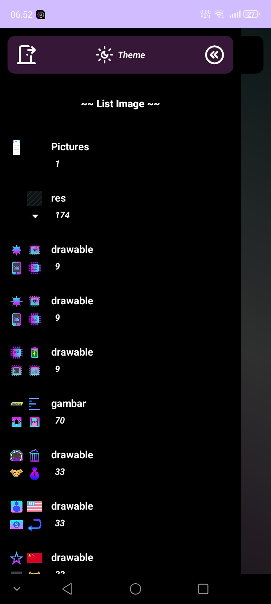
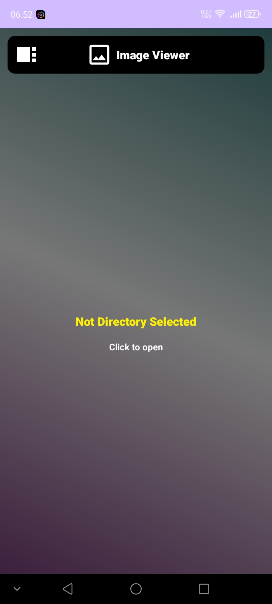

Image-View

Galeri gambar sederhana untuk Android.

Image-View menampilkan gambar berdasarkan folder melalui MediaStore, kemudian gambar dapat dibuka dalam tampilan penuh.

Fitur

- 📁 Menampilkan daftar folder gambar
- 🖼️ Menampilkan gambar di dalam folder
- 🔍 Membuka gambar
- 🌙 Dukungan tema terang dan gelap
- ⚡ Thumbnail gambar
- 📱 Dibuat menggunakan Kotlin untuk Android

Tampilan

Daftar folder

Daftar gambar

Alur

Folder
   ↓
Isi folder
   ↓
Gambar
   ↓
Penampil gambar

Download

Versi terbaru dapat diunduh melalui halaman Releases.

"Download APK" (../../releases)

Status

🚧 Masih dalam pengembangan.

Fitur dan tampilan dapat berubah pada versi berikutnya.

Lisensi

Belum ditentukan.